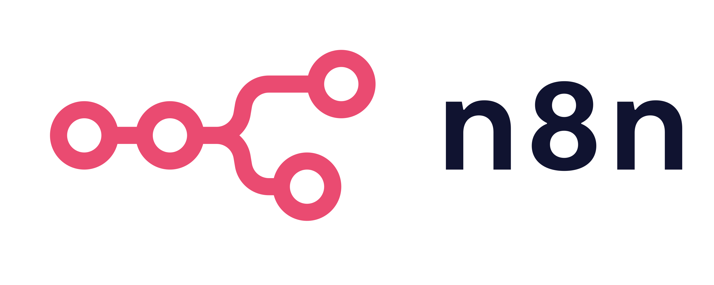

  

# n8n-php

A **lightweight PHP SDK** for [n8n](https://n8n.io), the open-source automation tool.  
Interact with your n8n instances programmatically, manage workflows, webhooks, and more.

---

## Why this exists

I was integrating n8n end-to-end in my own projects and felt the need for a PHP SDK.  
That’s how **n8n-php** was born.

It is still early, but this SDK is **feature-complete** for core use cases and ready for the PHP community to explore.

---

## Getting started

Get instantly started by installing and using the given code.

### Installation

~~~
composer require usmanzahid/n8n-php
~~~

### Quickstart

Use this code for instant testing and usage.

~~~
use UsmanZahid\N8n\N8nClient;
N8nClient::connect(
    'https://your-n8n-instance.com',
    'your-api-key'
);

$users = N8nClient::users()->listUsers();
var_dump($users); output a list of users
~~~

### Actual usage example

~~~
$tagsClient = N8nClient::tags();

$page = $tagsClient->listTags();

if(!$page->success){
    echo $page->message . PHP_EOL;
    die();
}

$tagList = $page->data;

// Check if next pages exist and get append the next pages as needed 
// This example keeps appends all pages
while ($tagsClient->hasMore($tagList)) {
    $tagsClient->appendNextTagPage($tagList);
}

foreach ($tagList->items as $tag) {
    echo $tag->name, PHP_EOL;
}

// Or you can just fetch all, this could be resource expensive if there are too many objects
$tagsListing = N8nClient::tags()->listTagsAll(); 
~~~

---

## Usage

### Connecting to N8n

~~~
use UsmanZahid\N8n\N8nClient;
N8nClient::connect(
    'https://your-n8n-instance.com', // API base URL
    'your-api-key',                  // API key
    'webhook-username',              // optional webhook username
    'webhook-password'               // optional webhook password
);
~~~

### Handling Responses and Errors

All responses are returned as an `N8nResponse` object:

~~~
$response->success;    // If the operation was successful or not
$response->data;       // Either a list object or an entity
$response->message;    // A string message for error understanding
$response->statusCode; // Status code of the response
~~~

Check for success before using the data:

~~~
if ($response->success) {
    // Process data
}
~~~

And this package handles issues gracefully and does not through any exceptions, the N8nResponse object does it all.

### Working with Webhooks

~~~
$response = N8nClient::webhook(WebhookMode::Production, RequestMethod::Post)
    ->send('your-webhook-id', ['data' => 'value']);

if ($response->success) {
    echo "Webhook sent successfully. Status code: " . $response->statusCode;
} else {
    echo "Error: " . $response->message;
}
~~~

### Working with Workflows

~~~
// List workflows (paginated)
$workflows = N8nClient::workflows()->listWorkflows(['limit' => 5]);

// List all workflows (auto-pagination)
$allWorkflows = N8nClient::workflows()->listWorkflowsAll();

// Append next page to an existing workflow list
$nextPage = N8nClient::workflows()->appendNextWorkflowPage($workflows);

// Get a single workflow
$workflow = N8nClient::workflows()->getWorkflow('workflow-id');

// Create a new workflow
$newWorkflow = N8nClient::workflows()->createWorkflow([
    'name' => 'My New Workflow',
    'nodes' => [],
]);

// Update a workflow
$updatedWorkflow = N8nClient::workflows()->updateWorkflow('workflow-id', [
    'name' => 'Updated Name',
]);

// Delete a workflow
$deletedWorkflow = N8nClient::workflows()->deleteWorkflow('workflow-id');

// Activate / Deactivate
N8nClient::workflows()->activateWorkflow('workflow-id');
N8nClient::workflows()->deactivateWorkflow('workflow-id');

// Transfer to another project
N8nClient::workflows()->transferWorkflow('workflow-id', 'project-id');

// Get / Update tags
$tags = N8nClient::workflows()->getTags('workflow-id');
N8nClient::workflows()->updateTags('workflow-id', ['tag1-id', 'tag2-id']);

~~~

### Working with Variables

~~~
// List variables
$variables = N8nClient::variables()->listVariables();

// List all variables
$allVariables = N8nClient::variables()->listVariablesAll();

// Append next page
$nextVariables = N8nClient::variables()->appendNextVariablePage($variables);

// Create, update, delete
$newVar = N8nClient::variables()->createVariable(['key' => 'foo', 'value' => 'bar']);
$updatedVar = N8nClient::variables()->updateVariable($newVar->data->id, ['value' => 'baz']);
N8nClient::variables()->deleteVariable($newVar->data->id);
~~~

### Working with Users

~~~
// List users
$users = N8nClient::users()->listUsers();
$allUsers = N8nClient::users()->listUsersAll();
$nextUsers = N8nClient::users()->appendNextUserPage($users);

// Create user
$newUser = N8nClient::users()->createUser([
    ['email' => 'user@example.com', 'firstName' => 'John', 'lastName' => 'Doe']
]);

// Get / Delete user
$user = N8nClient::users()->getUser('user@example.com');
N8nClient::users()->deleteUser('user@example.com');

// Change role
N8nClient::users()->changeUserRole('user@example.com', 'admin');
~~~

### Working with Tags

~~~
$tags = N8nClient::tags()->listTags();
$allTags = N8nClient::tags()->listTagsAll();
$nextTags = N8nClient::tags()->appendNextTagPage($tags);

$newTag = N8nClient::tags()->createTag(['name' => 'Important']);
$tag = N8nClient::tags()->getTag($newTag->data->id);
$updatedTag = N8nClient::tags()->updateTag($newTag->data->id, ['name' => 'Updated Tag']);
N8nClient::tags()->deleteTag($newTag->data->id);
~~~

### Working with Projects

~~~
$projects = N8nClient::projects()->listProjects();
$allProjects = N8nClient::projects()->listProjectsAll();
$nextProjects = N8nClient::projects()->appendNextProjectPage($projects);

$newProject = N8nClient::projects()->createProject(['name' => 'My Project']);
$updatedProject = N8nClient::projects()->updateProject($newProject->data->id, ['name' => 'Updated Project']);
N8nClient::projects()->deleteProject($newProject->data->id);

// Manage project users
N8nClient::projects()->addUsers($newProject->data->id, [['userId' => 'id', 'role' => 'member']]);
N8nClient::projects()->changeUserRole($newProject->data->id, 'id', 'admin');
N8nClient::projects()->deleteUser($newProject->data->id, 'id');
~~~

### Working with Executions

~~~
$executions = N8nClient::executions()->listExecutions(5);
$allExecutions = N8nClient::executions()->listExecutionsAll();
$nextExecutions = N8nClient::executions()->appendNextExecutionPage($executions);

$execution = N8nClient::executions()->getExecution('execution-id');
N8nClient::executions()->deleteExecution('execution-id');
N8nClient::executions()->stopExecution('execution-id');
N8nClient::executions()->retryExecution('execution-id', ['inputData' => []]);
~~~

### Working with Credentials

~~~
$schema = N8nClient::credentials()->getCredentialSchema('githubApi');

$newCredential = N8nClient::credentials()->createCredential([
    'name' => 'My GitHub Token',
    'type' => 'githubApi',
    'data' => ['token' => 'your-token']
]);

N8nClient::credentials()->deleteCredential($newCredential->data->id);
~~~

### Working with Audit

~~~
$audit = N8nClient::audit()->generateAudit(['action' => 'workflow_created']);
~~~

---

## Contributing

Your contributions are **greatly appreciated**!

If you use PHP and love automation, help make this SDK better for the community:

- Fork the repository
- Open pull requests
- Share ideas or report issues

Every contribution, big or small, makes a difference.

---

## License

MIT © Usman Zahid
